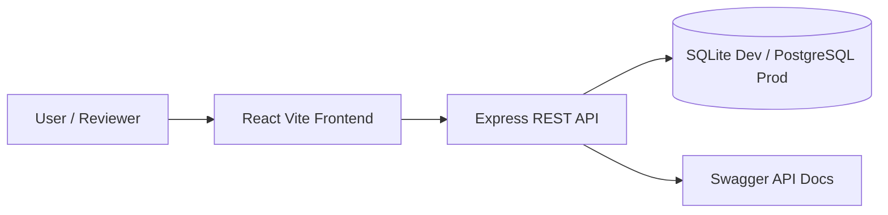
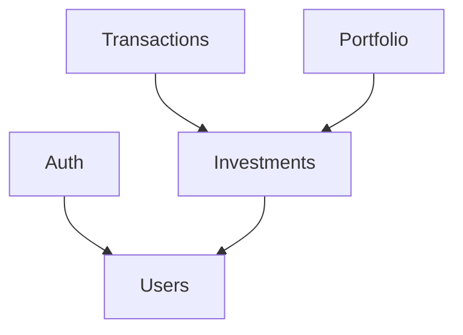
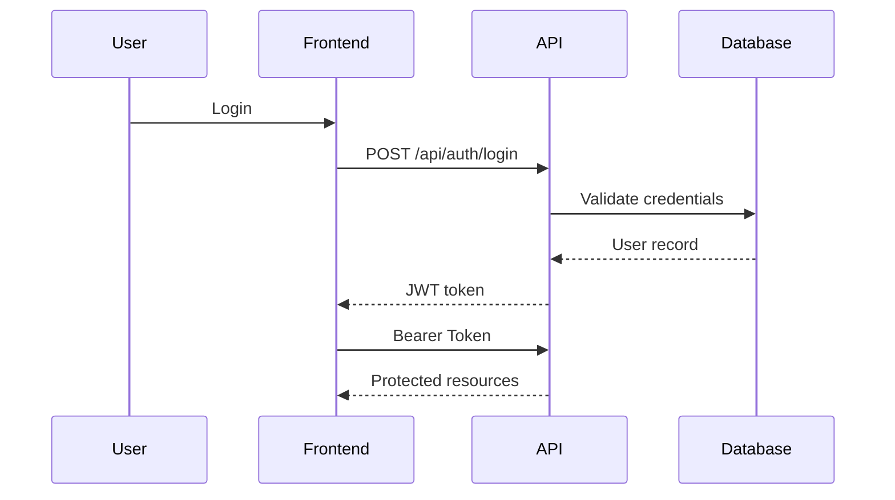

# Architecture

## High-Level Overview

This application is a basic Portfolio Management Dashboard that allows authenticated users to:

- Login using JWT authentication
- Manage investments
- Track buy/sell transactions
- View portfolio performance metrics
- Inspect APIs using Swagger



---

# Technology Stack

## Frontend

- React
- Vite
- TypeScript
- React Router

### Why Vite instead of Next.js?

The assessment requirements only specify:

- Node.js
- Express
- REST APIs

Since Server-Side Rendering (SSR) is not required, Vite provides:

- Faster startup
- Simpler structure
- Smaller learning curve
- Better suitability for SPA applications

---

## Backend

- Node.js
- Express
- TypeScript
- TypeORM

### Why TypeORM?

TypeORM was chosen because:

- Entity-driven design fits REST APIs naturally
- Supports SQLite and PostgreSQL with minimal code changes
- Migration support is available
- Decorator-based entities provide clear relationships

---

## Database Strategy

### Development

```text
SQLite
```

Benefits:

- Zero setup
- Fast local development
- Easy Docker integration

### Production

```text
PostgreSQL
```

Benefits:

- Better scalability
- ACID compliance
- Widely used in enterprise applications

The application switches database configuration based on:

```text
NODE_ENV
```

---

# Project Structure

```text
portfolio-management-dashboard
│
├── apps
│   ├── api
│   └── web
│
├── docs
│
├── docker-compose.dev.yml
│
└── README.md
```

---

# Backend Modules



### Auth Module

Responsibilities:

- Login
- JWT generation
- Profile endpoint
- Route protection

---

### Investment Module

Responsibilities:

- Create investments
- Update investments
- Delete investments
- Retrieve investment list

---

### Transaction Module

Responsibilities:

- Buy transactions
- Sell transactions
- Transaction history

---

### Portfolio Module

Responsibilities:

- Total invested amount
- Current portfolio value
- Gain/Loss calculation
- Asset allocation breakdown

---

# Authentication Flow



---

# API Documentation

Swagger UI is available at:

```text
http://localhost:3000/api-docs
```

Swagger provides:

- Endpoint documentation
- Request examples
- Response schemas
- Interactive API testing

---

# Testing Strategy

## Backend

Jest is used for:

- Service tests
- Middleware tests
- Configuration tests

## Frontend

Jest + React Testing Library are used for:

- Component rendering
- Screen behavior
- Error states

---

# Docker Setup

Development uses Docker Compose to ensure:

- Consistent environment
- Easy onboarding
- Minimal host machine dependencies

Services:

```text
web
api
sqlite volume
```

---

# Environment Configuration

Examples:

```text
NODE_ENV=development
DATABASE_TYPE=sqlite
DATABASE_PATH=/app/data/dev.sqlite
```

Production:

```text
NODE_ENV=production
POSTGRES_HOST=postgres
POSTGRES_DB=portfolio_db
```

---

# Future Improvements

Potential enhancements:

1. Refresh tokens
2. Input validation with Zod
3. Pagination
4. Search and filtering
5. CI/CD pipeline
6. Database migrations
7. Role-based access control
8. Dashboard charts and analytics
9. Dark mode
10. Audit logging

---

# Design Principles

This project emphasizes:

- Separation of concerns
- Testability
- Simplicity
- Docker-first development
- Incremental commits
- Production readiness